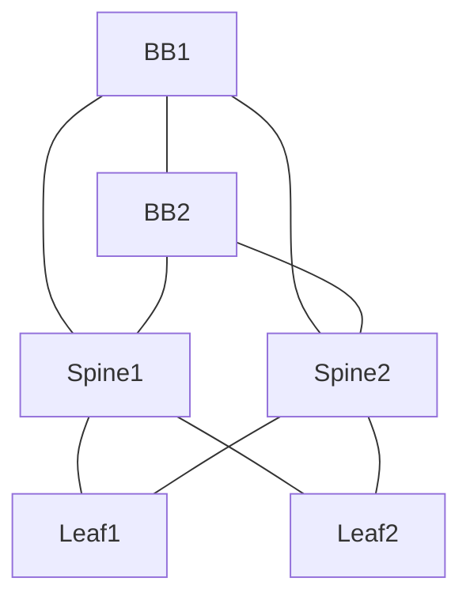

# BGP/OSPF Convergence & Failover Analyzer

A network-automation lab built with **Containerlab, FRRouting, and Python**.

The project simulates a redundant data-center fabric connected to a small BGP backbone. It can collect routing state, detect routing changes, inject controlled link failures, measure route convergence, and analyze the results across repeated runs.

## Architecture

The final topology contains:

- 2 leaf routers
- 2 spine routers
- 2 backbone routers
- OSPF inside the leaf-spine fabric
- eBGP from each spine to **both** backbone routers
- iBGP between the two backbone routers
- redundant paths and ECMP
- loopbacks used as stable test destinations


Every leaf is connected to both spines, and every spine is connected to both backbone routers. This gives redundancy at both the fabric layer and the northbound layer.

### Point-to-point links

| Link | Subnet | Protocol |
|---|---|---|
| Leaf1 - Spine1 | `10.0.13.0/30` | OSPF |
| Leaf1 - Spine2 | `10.0.14.0/30` | OSPF |
| Leaf2 - Spine1 | `10.0.23.0/30` | OSPF |
| Leaf2 - Spine2 | `10.0.24.0/30` | OSPF |
| Spine1 - BB1 | `10.0.35.0/30` | eBGP |
| Spine1 - BB2 | `10.0.36.0/30` | eBGP |
| Spine2 - BB1 | `10.0.45.0/30` | eBGP |
| Spine2 - BB2 | `10.0.46.0/30` | eBGP |
| BB1 - BB2 | `10.0.56.0/30` | iBGP |

### Loopbacks

```text
Leaf1       10.255.0.1/32
Leaf2       10.255.0.2/32
Spine1      10.255.0.3/32
Spine2      10.255.0.4/32
Backbone1   10.255.0.5/32
Backbone2   10.255.0.6/32
```

The Docker management network (`172.20.20.0/24`) exists for administration. Leaf1 and Leaf2 remove Docker's generated default route during topology creation so the management route cannot override the OSPF default used for the experiment.

## Python side

The automation deliberately stays small:

```text
SSH to router
    ↓
Collect OSPF / BGP / route JSON
    ↓
Normalize device-specific data
    ↓
Compare snapshots
    ↓
Inject controlled interface failures
    ↓
Measure route convergence
    ↓
Analyze repeated measurements
```

The project uses FRR's JSON-formatted operational output rather than parsing whitespace-dependent CLI tables.

The main Python components are:

```text
automation/
├── ssh_client.py          SSH command execution
├── devices.py             router inventory and experiment definitions
├── poller.py              routing-state collection
├── state.py               FRR JSON normalization
├── diff.py                routing-change detection
├── failure_injection.py   controlled interface shutdown/restore
├── convergence.py         convergence experiments
└── analyze.py             min/max/average/range analysis
```

## What an experiment does

For a scenario such as `spine1_bb1`:

1. The tool checks the baseline route to `10.255.0.1/32`.
2. It verifies that the route currently uses the next hop that will be failed.
3. Python shuts down the selected interface through SSH and `vtysh`.
4. The tool polls the monitored route repeatedly.
5. It detects when the route moves away from the failed next hop and stays there for consecutive polls.
6. It records the observed convergence time.
7. It automatically restores the interface.
8. The result is written as JSON.

The supported convergence scenarios are:

```text
spine1_bb1
spine1_bb2
spine2_bb1
spine2_bb2
```

## Basic workflow

Deploy the lab:

```bash
cd ~/bgp-ospf-failover-analyzer/topology/fabric
sudo containerlab deploy --topology topology.yml
```

Activate the Python environment:

```bash
cd ~/bgp-ospf-failover-analyzer
source .venv/bin/activate
```

Collect a snapshot:

```bash
cd automation
python main.py
```

Run one convergence experiment:

```bash
python -m convergence spine1_bb1
```

Run all scenarios three times:

```bash
python -m convergence all --runs 3
```

Analyze the resulting JSON:

```bash
python -m analyze ../data/convergence/<results-file>.json
```

The analysis reports average, minimum, maximum, and range for each scenario and identifies the fastest scenario by average convergence time.

## Why the topology was redesigned

The first version connected each spine to only one backbone router. That looked redundant from the leaf's perspective, but it left each spine with a single northbound exit.

A failure exposed the weakness: a leaf could still reach a healthy spine through OSPF even after that spine had lost its only BGP path to the backbone. A narrow BGP-to-OSPF transit-prefix workaround restored end-to-end connectivity, but it was solving a topology problem with additional routing policy.

The final design connects both spines to both backbone routers and removes that workaround. OSPF remains the internal fabric protocol, while BGP handles the fabric/backbone boundary. The spines themselves now have genuine northbound redundancy.

## Lessons from the project

The most useful lessons were not specific commands. They were troubleshooting habits:

- A healthy OSPF/BGP control plane does not prove that the end-to-end data path is correct.
- Always inspect the actual forwarding/return path when a ping fails.
- Management-plane routes can accidentally interfere with a routing experiment.
- A workaround that makes a test pass can still reveal an architectural weakness.
- Treat external JSON schemas conservatively; a missing field is not automatically a positive value.
- A convergence measurement made by polling is an observed measurement, not an exact hardware timestamp.

## Scope

The project intentionally stops after the core analysis loop:

1. redundant routing topology
2. Python state collection
3. state diffing
4. automated failure injection
5. convergence measurement
6. basic statistical analysis

Automated remediation, alerting infrastructure, and a large orchestration framework were deliberately left out. The aim is to keep the project technically meaningful while still being small enough to understand end-to-end.

## Environment

```text
MacBook (Apple Silicon / ARM)
        ↓
UTM
        ↓
Ubuntu ARM/aarch64 VM
        ↓
Docker
        ↓
Containerlab
        ↓
FRRouting 10.7.1
```

The FRR image used by the lab is a small SSH-enabled image derived from FRR 10.7.1. The lab also uses bind-mounted `/etc/frr` directories so verified FRR configuration can persist through container recreation.
